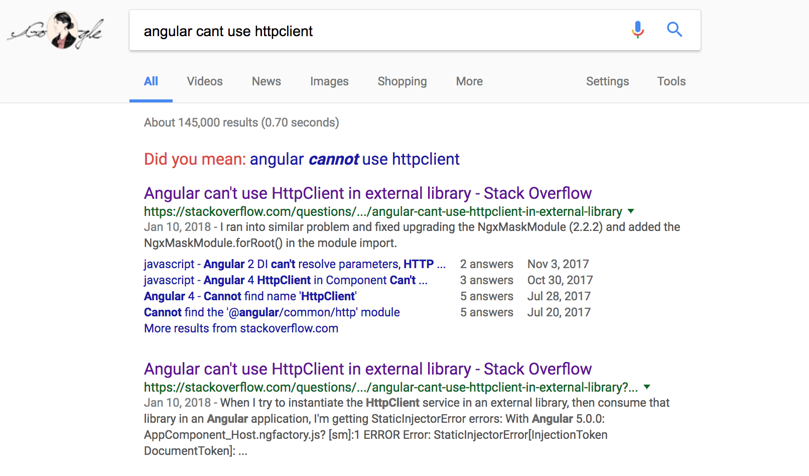

Asking questions are important because they are the best way to exchange knowledge with each other. Imagine walking through a paper mill, it's your first job. The supervisor says, "Make sure to take out the paper when it's finished". Why do we need to take out the paper? Why do we need to stand in this exact place to do it? Asking questions like these shows you're listenting, it shows that you are trying to come to an understanding of what the heck is going on? You take out the paper so Larry the Truck Driver can assist you. You stand in this spot because the paper comes out hot, and it'll burn you. Two questions, and you just learned about this process in 10 seconds what it would have taken you maybe a whole shift to figure out. That's a smart question. In this essay, I will examine the smart way, and the "not smart" way to answer a question.

https://stackoverflow.com/questions/48174555/angular-cant-use-httpclient-in-external-library. This is the right way to answer a question. It's clear he searched the term, because using general search words related to his question, his pops up first. He posted it to the site where it's most on-topic, and it's properly formatted well. And he also follows the point that Eric Raymond tries to drill in our brains, "Show me". He provides proper logs/errors of the service, he tags it properly, and most importantly, it follows a clear and concise thought process about how he got this error. 

https://stackoverflow.com/questions/48453132/double-equals-in-strings-vs-arrays-java This is the wrong way to answer a question, in fact it might get deleted due to how much other posts there are. The gist of this question is "==" in Strings vs Arrays. Dude, there is over 1,430,000 results on Google with the literal search term "java == array vs string". He also breaks one of Raymond's cardinal rules "Be explicit about your question". This post can be reconstructed as "How do objects work in Java", and I reckon he knows that too, because he has an "object" tag. If you can condense Raymond's post into three words, I believe it would be "Just Google It". This user should have googled it first. There are no dumb questions, but maybe google it first.

To surmise, smart questions are important becuase they get us to think. A good question should make your teacher happy you asked it, becuase it shows you are following along. A good question pushes your knowledge forward, but it must never be lazy. It must never be lazily constructed, because the people who know the answer will not answer it. Or as Raymond says it best, "RTFM" or "STFW". 