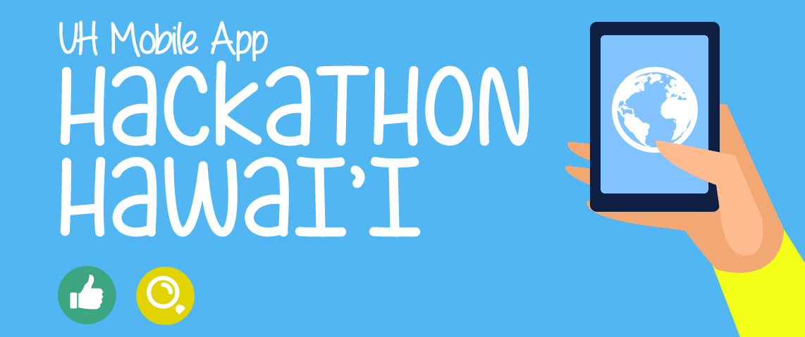

  
  
  

That got us thinking, the best way to get that information would be to give it to someone as soon as they sign in. This is a common practice, any outdoor event will have some sort of pamphlet with information. We were at a tech event, why not make it way easier. We can use NFC to give everyone that information as soon as they walk in.

We used Raspberry Pi's for this project. I was responsible for the implementatoin of this program in the Swift language. Other groupmates would setup the Pi, and I worked on the app. I started by programming a basic app, that could check for avaliable NFC signals. When an NFC signal was detected, it would open a download to a file hosted by AWS. 

We managed to get the project working, and received decent marks from the judges. More information about the ATT Hackathon[can be found on their website](https://www.eventbrite.com/e/att-hackathon-hawaii-tickets-31100289804).

You can learn more at the [UH Micromouse Website](http://www-ee.eng.hawaii.edu/~mmouse/about.html).

