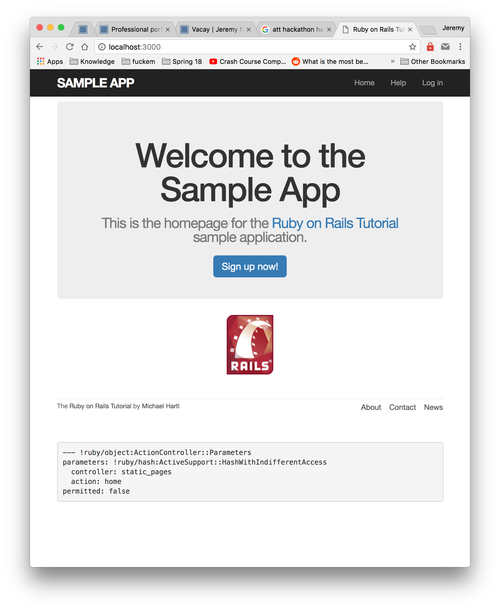

Sign In is a web application from the website https://www.railstutorial.org/book. This project helped teach me about Web Development, with various frameworks and libraries such as Rails and Boosstrap. 

Sign In is implemented using [Rails](http://rubyonrails.org/), a Ruby framework for web development. I initially took an intrest in Ruby from its simplicity, its syntax is what drew me in. Rails was an extension of that thought process, the ease that it took to get a working Web Stack going was second to none.

I learned a lot about this project, and web development in general. Before this project, I only had the slightest idea of how to make a basic HTML page, with no idea how to actually access that website from a server..

 
Source: <a href="https://github.com/jjnaga/sample_app"><i class="large github icon"></i>theVacay/vacay</a>