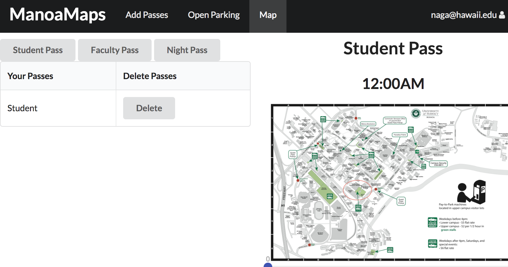

Manoa Maps is a Meteor application that shows you the times in Manoa. Manoa has various parking stalls where you can pay to park for a designated time, and it's a little tricky to master. And the worst part about it all is how fast the Parking Attendents ticket you if you're even off in your time by a few minutes.

We decided to fix that by showing you where you can park, and if you have a parking pass, where it enables you to park. We tied a simple Mongo DB to let the user login, and add a parking pass. We then will update the map with the correct image of Manoa with your designated locations to park. We tried to implement Google Maps, but found it not adaquate for the content we were trying to convey.

My contribution was with the UI, I used React to setup the various components and pages needed to show our content. I also created the Google Maps portion of the project. I learned how to use React to create re-usable code, which was pretty nifty.
 
Source: <a href="https://github.com/manoamaps/source"><i class="large github icon"></i>manoamaps/source</a>
